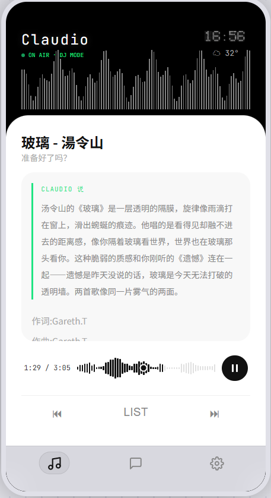

# 🎧 Claudio

> *"It's late on a Monday, and here's a song that moves with your breath…"*
> — 你的 24 小时 AI 电台 DJ，比你自己更懂你想听什么

---

## ✨ 这玩意儿是啥

Claudio 不是播放器。播放器只会放歌。

Claudio 会**看着窗外的天气 🏙️、翻翻你的日历 📅、想想你几点起床 🌅、回忆你过去爱听什么 🧠**——然后像一个真正的电台 DJ 一样，用温柔的嗓音告诉你：下一首该听什么。

它是一股「反效率」的力量——在你和 Claude Code 多线程搏斗到脑壳冒烟的时候，它安静地待在侧屏幕上，帮你呼吸 🫁。

---

## 🧠 它怎么想的

```
  🌤️ 天气  ───┐
  📅 日程  ───┤
  🎵 品味  ───┼──→ 🧠 Claude ──→ 💬 DJ 播报词 + 🎶 歌单
  ⏰ 时间  ───┤
  📝 记忆  ───┘
```

### 🏗️ 四层小宇宙

| 🧱 层 | 🎯 干嘛的 | 🛠️ 里面有什么 |
|---|---|---|
| **① 外部感官** | 睁眼看世界 | 你的品味档案 📂 · Claude API 🧠 · 网易云 🎵 · Fish TTS 🗣️ · 飞书日历 📅 · OpenWeather 🌤️ · UPnP 📻 |
| **② 本地大脑** | 思考 & 决策 | 意图分流器 · Prompt 炼金术 · SSE 流式响应 · 节律时钟 · 声音合成管线 · 记忆库 |
| **③ 运行时熔炉** | 六片拼图粘成一个 prompt | ① DJ 人设 → ② 你的品味 → ③ 环境注入 → ④ 历史记忆 → ⑤ 你说的话 → ⑥ 执行轨迹 |
| **④ 交互表层** | 你看见 & 触碰的 | PWA 三视图 🎛️ · 10 条 HTTP 魔法线 · WebSocket 实时心跳 💓 |

---

## 🎨 

视觉效果——还是需要打磨打磨……没有达到预期，期待前端大手子来帮忙（做梦中）



- 🖤 极黑底色 `#0d0d0d`，铺满 25px 的像素点阵噪点
- 🟢 `#00ff88` 呼吸灯一闪一闪：「ON AIR · DJ MODE」
- 〰️ 镜像对称波形——75 条采样线上下延伸，左边墨黑右边浅灰，像 Logic Pro 里截出来的音频片段
- 🎤 歌词逐字点亮——不是变色，是绿色滑块扫过文字，跟着时间戳走
- 🔮 毛玻璃气泡 `blur(20px)` + 弹簧物理缓动——消息不是 fade 进来的，是弹进来的
- 🌓 一键切换深色 / 薰衣草浅色

> 原型在 `Pageprototype/` 里，你可以打开 `twopage.html` 先感受一下 ✨

---

## ⚡ 五分钟把它叫醒

### 🧩 你需要准备

| 零件 | 干嘛的 | 怎么搞 |
|---|---|---|
| **Node.js** ≥ 18 | 跑起来 | `node -v` 看一眼 |
| **NeteaseCloudMusicApi** | Claudio 的曲库 | `npx -y NeteaseCloudMusicApi --port 3000` |
| **Claude API** | 大脑 | 找个兼容 OpenAI 格式的中转平台 |
| **OpenWeather API Key** | 知道外面刮风还是下雨 | [openweathermap.org](https://openweathermap.org) 免费注册 |
| **Fish Audio API Key** | 让 Claudio 开口说话 | [fish.audio](https://fish.audio) 注册，充一点点钱 |
| **HTTP 代理** | 帮 Fish Audio 翻墙 | Clash / V2Ray，默认 `127.0.0.1:7897` |

### 1️⃣ 装零件

```bash
# 根目录（https-proxy-agent 等）
npm install

# 服务端
cd server && npm install
```

### 2️⃣ 告诉它你的秘密

在项目根目录创建 `.env` 文件：

```bash
# Claude 大模型（中转平台，兼容 OpenAI 格式）
CLAUDE_API_KEY=sk-你的中转平台Key
CLAUDE_BASE_URL=https://你的中转平台地址

# 天气（OpenWeather 免费注册即可）
OPENWEATHER_API_KEY=你的_OpenWeather_Key

# Fish Audio TTS（充值后才能用，别问我是怎么知道的）
FISH_API_KEY=你的_Fish_Audio_Key

# HTTP 代理（Fish Audio 需要，其他服务都直连）
HTTP_PROXY=http://127.0.0.1:7897
```

`server/config.json` 里改一下你的名字和城市：

```json
{
  "user": { "name": "你的昵称", "city": "Shenzhen" },
  "claude": { "model": "claude-sonnet-4-6" }
}
```

> `config.example.json` 是空白模板，里面有每一行的注释，抄作业就行。

### 3️⃣ 登录网易云（拿到 cookie）

```bash
cd server && node scripts/ncm-login.js
```

终端会出现一个 ASCII 二维码，掏出手机网易云 APP 扫码。搞定后 cookie 自动写进 `.env`，不用自己抠。

### 4️⃣ 启动网易云 API 引擎

```bash
npx -y NeteaseCloudMusicApi --port 3000
```

保持这个窗口开着，这是 Claudio 的曲库。

### 5️⃣ 喊醒 Claudio

再开一个终端：

```bash
cd server && node index.js
```

打开 `http://localhost:8080`，对着聊天框说话 🎉

### 🧹 关掉

```bash
# Windows
taskkill //F //IM node.exe

# macOS / Linux
pkill -f "node index.js"
pkill -f "NeteaseCloudMusicApi"
```

---

## 🎛️ 调教指南

### 🗣️ 换个声音

Claudio 说话的声音是可以换的。在 `server/config.json` 里找到 `tts` 这一段：

```json
"tts": {
  "provider": "fish_audio",
  "voice_id": "68c13a4c190a4057a6c1f91e72c6c3e4",
  "speed": 1.1
}
```

| 参数 | 干嘛的 | 怎么调 |
|---|---|---|
| `voice_id` | 谁来说话 | 去 [fish.audio](https://fish.audio/zh-CN/) 试听，URL 里那串乱码就是 ID |
| `speed` | 说多快 | 0.5（树懒）~ 2.0（华少），推荐 0.9 ~ 1.2 |

几把好听的温柔女声：

| 感觉 | voice_id |
|---|---|
| 温柔文艺女声（热门 🔥） | `68c13a4c190a4057a6c1f91e72c6c3e4` |
| 温柔女声 讲解 | `3c75b2d0c620482d81adb223b25396a7` |
| 温柔女声 甜美对话 | `6402fe3038e041f5803f7a9ae09f3ba1` |

改完**要重启服务器**才生效。这个设计不太优雅，我知道，但先这样。

### 📝 教它懂你的品味

`user/` 目录下有四个文件，是 Claudio 的「长期记忆」：

| 文件 | 写什么 |
|---|---|
| `user/taste.md` | 喜欢什么歌手/流派、什么场景听什么、讨厌什么 |
| `user/routines.md` | 几点起床、几点上班、几点犯困 |
| `user/mood-rules.md` | 「如果下雨 → 来点 lo-fi」「如果加班 → 来点提神的」 |
| `user/playlists.json` | 歌单 ID 和收藏，结构化的 |

这四个文件改了立刻生效，不用重启。

---

## 📡 API 一览

| 🔧 方法 | 🛣️ 路径 | 💬 它会 |
|---|---|---|
| `POST` | `/api/chat` | 跟你聊天 + 给你排歌 + 生成 DJ 串词（SSE 流式） |
| `GET` | `/api/now` | 告诉你现在在播什么 |
| `GET` | `/api/next` | 剧透下一首 |
| `GET` | `/api/search?q=` | 在网易云里翻箱倒柜 |
| `GET` | `/api/song/:id` | 掏出某首歌的链接和歌词 |
| `GET` | `/api/taste` | 回忆你的品味档案 |
| `GET` | `/api/plan/today` | 报告今天的音乐计划 |
| `GET` | `/api/history` | 翻聊天记录和听歌历史 |
| `GET` | `/api/weather` | 外面冷不冷下没下雨 |
| `⚡` | `/stream` | WebSocket 实时心跳：当前曲目、DJ 播报、TTS 就绪、进度更新 |

---

## 🧭 走到哪了

- [x] 🏗️ 工程骨架 + 配置系统 + SQLite 记忆库
- [x] 🧠 Claude HTTP 直连 + SSE 流式聊天 + 6 片 Context 炼金
- [x] 🌤️🎵 天气 + 网易云全链路（QR 登录 / cookie / 用户数据注入）
- [x] 🌐 10 条 HTTP 端点 + WebSocket 实时心跳
- [x] 📱 PWA 三视图 + 视觉规范落地 + Service Worker
- [x] ⚡ 速度优化（25s → 7.8s，CLI → HTTP 直连）
- [x] 🗣️ Fish Audio TTS（代理修复 + 声音/语速可调）
- [x] 🎚️ 进度条拖动 + BGM 间奏循环 + 播报协调状态机
- [ ] 📝 用户品味语料填充（模板写好了，等你往里填东西）
- [ ] 🕐 点阵时钟 Canvas 绘制
- [ ] 📻 UPnP 推到客厅音响
- [ ] 🎙️ DJ 播报词灵魂调优

---

## 📂 翻开看看

```
claudio/
├── server/                     # 🧠 中枢神经系统
│   ├── index.js                #   总闸：SSE 流式 + 10 个端点
│   ├── config.json             #   你的秘密（gitignore 护体）
│   ├── config.example.json     #   空白表格，带注释
│   ├── core/                   #   🧬 大脑皮层（Claude + Context + HTTP）
│   ├── integrations/           #   🔌 感官组件（天气/网易云/TTS/日历）
│   ├── network/                #   📡 神经传导（Router + WebSocket）
│   ├── scheduler/              #   ⏰ 生物钟
│   ├── state/                  #   💾 记忆库
│   └── scripts/                #   🔧 小工具（NCM 登录）
├── public/                     # 🎭 皮囊（PWA）
│   ├── index.html              #   三视图 + SVG 标签栏
│   ├── css/app.css             #   视觉规范的每一行
│   ├── js/app.js               #   全功能交互逻辑
│   ├── sw.js                   #   离线也能用
│   └── manifest.json           #   可以被「安装」
├── prompts/dj-persona.md       # 🎙️ Claudio 的人格剧本
├── user/                       # 📓 你的音乐日记
├── cache/tts/                  # 🔊 合成好的语音缓存
├── Architecture/               # 🏛️ 设计蓝图
├── Pageprototype/              # 🎨 颜值原型
├── docs/devlog.md              # 📝 从 0 到 1 的每一脚
└── README.md                   # 📖 你正在看的这个
```

---

## 🩺 救命，它不动了（常见异常解决方案）

**Q: Claude API 返回「检测到客户端异常」**

你的中转平台可能只认 Claude Code 客户端，不认普通 HTTP。换个兼容 OpenAI 格式的中转站。

**Q: TTS 报 `fetch failed`**

八成是代理没开。确认 `HTTP_PROXY=http://127.0.0.1:7897` 写进 `.env` 了，且 Clash/V2Ray 活着。Fish Audio 在国内被墙，没代理发不出声。

**Q: 网易云歌单返回空**

Cookie 可能过期了。重新跑 `node scripts/ncm-login.js` 扫个码。

**Q: 天气一直是 null**

`config.json` 里的 `city` 得用英文拼音（`Shenzhen` 不是 `深圳`），OpenWeather 不认识中文。

**Q: 改了 config.json 没反应**

重启服务器。这个是故意的——改 `user/*.md` 不用重启，改配置要。不优雅但能用。

**Q: WebSocket 一直断**

看看防火墙是不是拦了 8080 端口。

---

## 🫶 为什么做这个

每天和 Claude Code 多线程协作，注意力烧干了 🔥。

我需要一个放在侧屏幕上的东西——不催我、不卷我、不给我弹通知。

它只是在我盯着代码的时候，安安静静地切一首对的歌 🎵。

Claudio 是我的「反效率」实验。

如果你也觉得生活需要一点温柔的白噪音，欢迎把它装到你的机器里 ✨

---

## 📜 License

MIT —— 拿去改成你喜欢的样子 🎸
